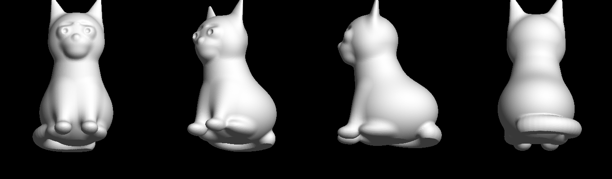

# Kitten figurine — 3D printable

`kitten_80mm.stl` is a sitting-kitten figurine, ready to slice.



## The file

| | |
|---|---|
| Height | 80 mm |
| Bounding box | 44.4 × 57.1 × 80.0 mm |
| Footprint on the plate | 33.5 × 52.3 mm |
| Triangles | 140,000 |
| Solid volume | 66.8 cm³ (that is the *solid* figure — at 15 % infill expect roughly 20–25 g of filament) |

Verified before export:

- watertight, single closed shell (Euler number 2 — no holes, no handles)
- consistent winding, normals facing outward (positive volume)
- no degenerate triangles
- base sits exactly on z = 0, so it lands flat on the plate with no manual drop

## Printing notes

- **Supports: yes.** About 29 % of the surface overhangs past 45°, mostly the chin, the chest under the head, and the undersides of the front legs. Tree supports work well and peel off the smooth surfaces cleanly.
- **Orientation:** print as-is. The flat base is deliberate and gives a solid first layer; no raft needed.
- 0.15–0.2 mm layers are plenty. The finest details are the pupil dimples and brow creases (~1–2 mm features), which survive down to about 50 mm total height.
- Below ~45 mm tall the ear tips get thin — scale down further only if your nozzle is 0.4 mm or finer.

## Regenerating or resizing

The STL is generated, not hand-sculpted, so any size comes out at full quality:

```bash
pip install numpy scikit-image trimesh fast-simplification

python3 kitten_model.py --height 120 --out kitten_120mm.stl
python3 kitten_model.py --height 50 --resolution 360 --out kitten_50mm.stl
```

- `--height` — final height in mm (default 80)
- `--resolution` — voxels along the longest axis (default 320; raise for finer detail, it costs time and triangles)
- `--max-faces` — decimation target (default 140000; `0` keeps the full mesh)

## How it is built

`kitten_model.py` defines the kitten as a **signed distance field**: ellipsoids, spheres and tapered round cones for the body, head, ears, legs and tail, combined with a polynomial smooth-minimum so the joins blend organically instead of showing hard boolean seams. Eyes and brows are carved back out with a smooth subtraction. The solid is intersected with the `z >= 0` half-space to give the flat base, then surfaced with marching cubes.

Building it this way means the result is manifold and non-self-intersecting by construction — the two things that usually make a sculpted mesh fail in a slicer.

Two details worth knowing if you edit it:

- The sample grid is deliberately nudged off `z = 0` (`0.317 * pitch`). The flat-base cut puts a kink exactly on that plane, and samples landing precisely on the level set make marching cubes emit degenerate, non-manifold triangles.
- The field is padded with a large positive value before surfacing, so the shell always closes even if a limb reaches the edge of the domain.
