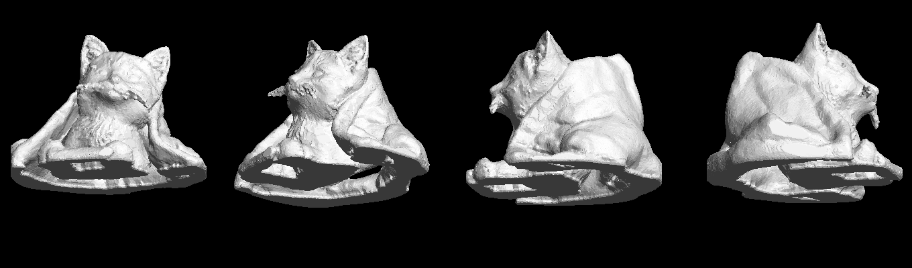

# Kitten — 3D printable

Two models, both verified printable.

| File | What it is | Size |
|---|---|---|
| `kitten_scan_70mm.stl` | **Your kitten**, reconstructed from the photo | 70 × 63.6 × 50.9 mm |
| `kitten_80mm.stl` | A stylized sitting-cat figurine, modelled parametrically | 44.4 × 57.1 × 80 mm |

---

## `kitten_scan_70mm.stl` — the likeness



Your kitten reclining, ears and face intact, on the blanket it was photographed on. Built from the photo: background removed, image-to-3D reconstruction, then repaired into a printable solid by `glb_to_stl.py`.

| | |
|---|---|
| Bounding box | 70.0 × 63.6 × 50.9 mm |
| Footprint on the plate | 69.4 × 62.6 mm |
| Triangles | 150,000 |
| Solid volume | 48.5 cm³ |

Verified: watertight, single component, consistent outward winding, no degenerate triangles, sits exactly on z = 0.

**Printing:** the wide flat blanket base gives excellent bed adhesion — no raft or brim needed. About 31 % of the surface overhangs past 45° (under the chin, the jaw, and the far side of the body), so use supports; tree supports come away cleanly from the fur texture.

**What to expect from it.** This came from a *single* close-up photo, so the reconstruction invented everything the camera could not see. The head and face are a genuine likeness; the far side and the back of the body are plausible guesswork. The whiskers were removed deliberately — they were reconstructed as sub-millimetre spikes that no printer will produce and that only break off.

## `kitten_80mm.stl` — the figurine

A clean, stylized sitting cat generated from `kitten_model.py`. Not a likeness — use it if you want a crisp ornament rather than a scan.

| | |
|---|---|
| Bounding box | 44.4 × 57.1 × 80.0 mm |
| Footprint | 33.5 × 52.3 mm |
| Triangles | 140,000 |
| Solid volume | 66.8 cm³ |

Verified watertight, Euler number 2 (single closed shell, no holes or handles), flat base. About 29 % overhang past 45° — supports recommended. 0.15–0.2 mm layers; below ~45 mm tall the ear tips get thin.

---

## Regenerating either model

```bash
pip install numpy scipy scikit-image trimesh fast-simplification
```

**From the photo-derived GLB:**

```bash
python3 glb_to_stl.py path/to/kitten.glb --height 100 --out kitten_100mm.stl
```

`--height` sets the longest horizontal dimension in mm. Other knobs: `--resolution` (voxel grid, default 320), `--seal` (hole-bridging radius), `--despeckle` (whisker removal), `--base-trim`, `--max-faces`.

**The figurine:**

```bash
python3 kitten_model.py --height 120 --out kitten_120mm.stl
```

---

## How the repair works

The reconstruction is a good likeness but not a solid, and three separate things had to be fixed before it would slice:

1. **Vertices split along texture seams.** 153k faces carried 235k vertices, so the mesh read as non-manifold with 224,752 boundary edges. Welding on geometry alone (trimesh's `merge_vertices` preserves the seams) brought that down to 1,508.

2. **The fill leaked.** The model is open underneath, where the kitten met the blanket, so flood-filling the interior escaped through the bottom and left a hollow shell — 6.7 cm³ where the geometry should hold about 48 cm³. Two fixes: trim past the ragged bottom edge and seal the exposed cross-section in 2D, and bridge the remaining holes by **dilating before the fill and eroding by the same amount afterwards**. Plain morphological closing is not enough — measuring across seal radii showed the fill succeeds on a coarse grid and fails on a fine one, because a coarse pitch bridges those gaps for free. The seal radius has to scale with resolution.

3. **The whiskers.** Modelled as sub-millimetre spikes. A morphological opening deletes structures thinner than its kernel while leaving the solid body untouched — but only once the body is genuinely solid. Run against the leaked shell it ate 36 % of the model; against the real solid it removes 0.8 %, which is the whiskers.

The voxel round trip is what guarantees the output is manifold and non-self-intersecting. Patching holes in a broken surface in place does not.

One other trap worth recording: trimesh's `simplify_quadric_decimation` failed the watertight check at every target tried (150k, 300k, 600k), which silently left a 975k-triangle mesh. Calling `fast_simplification.simplify` directly reduces the same mesh to 150k faces with zero boundary and zero non-manifold edges.

`kitten_model.py` builds the figurine instead as a signed distance field — ellipsoids, spheres and tapered round cones combined with a polynomial smooth-minimum, carved for the eyes and brows, intersected with the `z >= 0` half-space for the flat base, then surfaced with marching cubes. Its sample grid is deliberately nudged off `z = 0`: the base cut puts a kink exactly on that plane, and samples landing precisely on the level set make marching cubes emit degenerate, non-manifold triangles.
